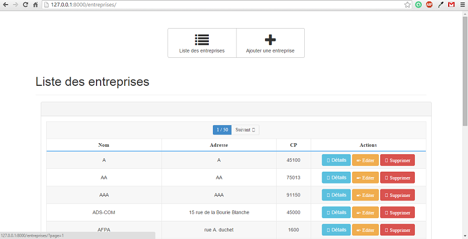
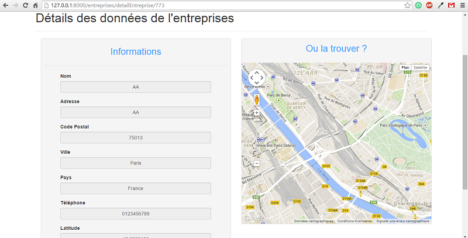
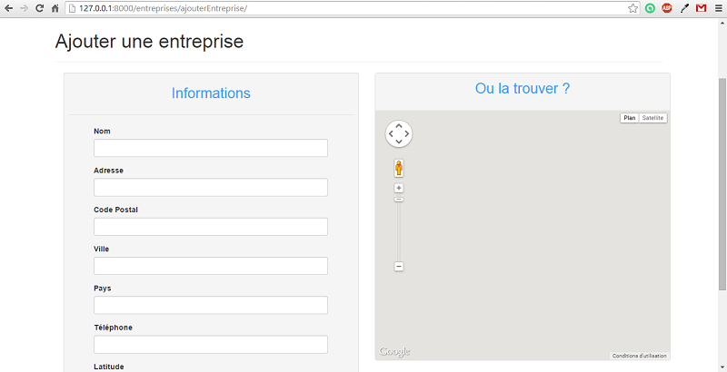
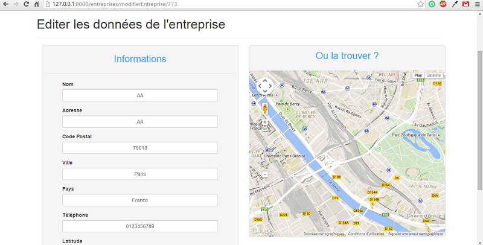
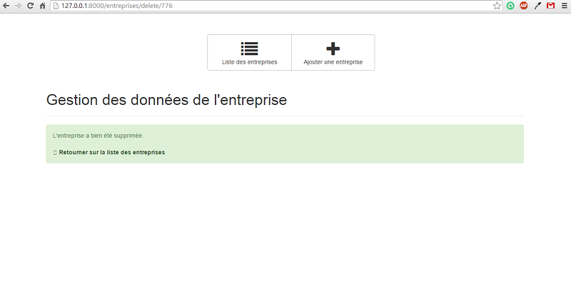

# Gestion Stage

## 1. Navigation 

## 2. Liste des entreprises

## 3. Voir une entreprise

### 3.2 Geolocalisation de cette entreprise

- Géolocalisation:

Nécessite l'installation de pygeocoderet importer les packages de géolocalisation dans les modèles.

- Utilisation de l’API Google map:

Afficher la position de l'entreprise grâce à ses coordonnées.

## 4. Ajouter une entreprise

Remarque :

On a obligé la saisie de tous les champs.

## 5. Modifier les données d'une entreprise

## 6. Supprimer une entreprise

